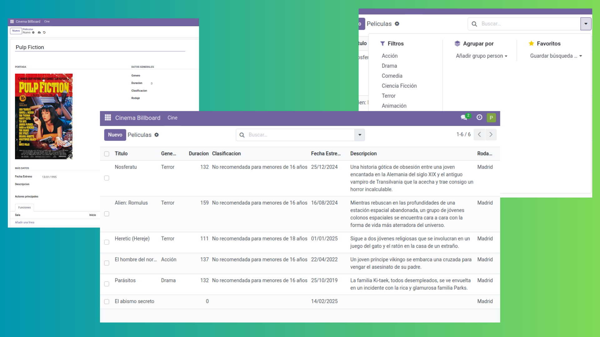
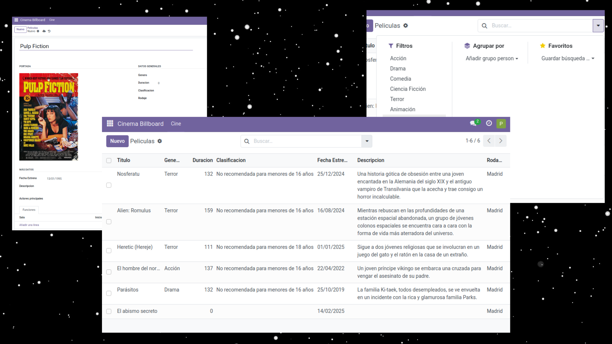

# Pasos para crear un módulo en Odoo 17

## Crear la carpeta donde se guardarán todos los archivos y subcarpetas del módulo

Los primeros archivos que crearemos serán los de configuración: `__init__.py` y `__manifest__.py`.  
Posteriormente, creamos las carpetas de los modelos, seguridad y vistas.  

```
├── models
├── security
├── views
├── init.py
└── manifest.py
```
Una vez tengamos la estructura general, vamos a ir agregando los archivos correspondientes a cada carpeta
### models
```
├── init.py
├── billboard_funcion.py
├── billboard_pelicula.py
└── billboard_sala.py
```
### security
```
├── ir.model.access.csv
```
### views
```
├── billboard_funcion_views.xml
├── billboard_menus.xml
├── billboard_pelicula_views.xml
└── billboard_sala_views.xml
```

Para reiniciar el servidor de Odoo y aplicar los cambios debemos hacerlo mediante esta línea de comando:

`sudo service odoo restart`

Capturas de ejecución del módulo:



